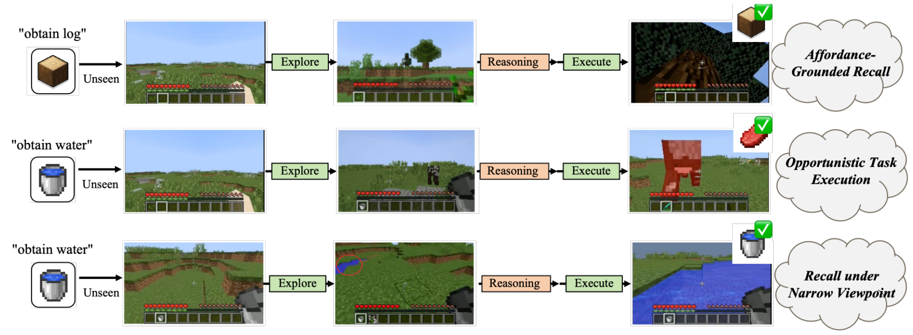
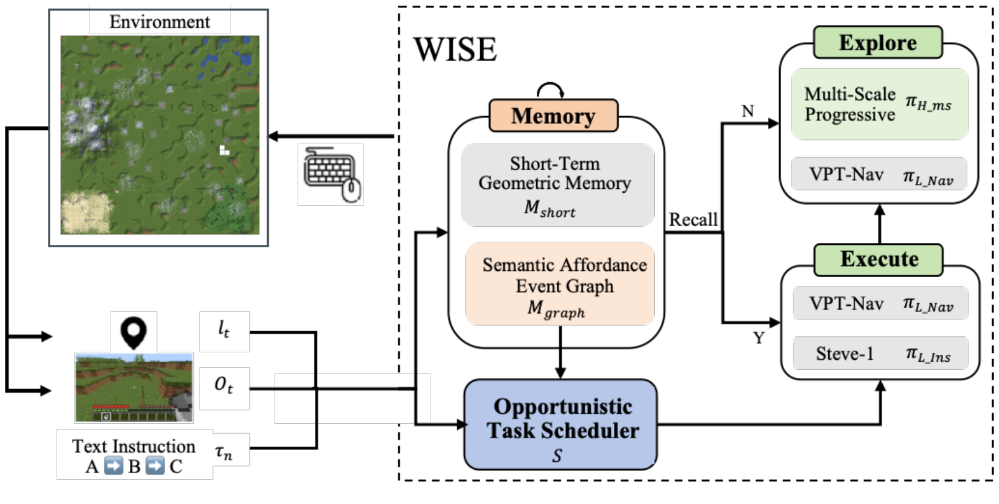

<div align="center">

# WISE
### A Long-Horizon Agent in Minecraft with Why-Which Reasoning

**Renmin Cheng · Changhao Chen**

The Hong Kong University of Science and Technology (Guangzhou)<br>
The Hong Kong University of Science and Technology

**Transactions on Machine Learning Research (TMLR), 2026**

[](https://openreview.net/forum?id=T8HuiP3yM9)
[](https://openreview.net/forum?id=T8HuiP3yM9)
[](#getting-started)
[](#release-status)

[Paper](https://openreview.net/forum?id=T8HuiP3yM9) · [Method](#method) · [Results](#results) · [Getting Started](#getting-started) · [Citation](#citation)

**Remember what, where, and when. Reason about why and which.**

</div>

<p align="center">
  
</p>

## Overview

**WISE (Which-Why Informed Semantic Explorer)** connects exploration, memory, and
decision-making for long-horizon Minecraft tasks. Its **Semantic Affordance Event
Graph (SAEG)** links observed entities to the outcomes they enable: remembering a
cow becomes actionable knowledge for obtaining beef. An **Opportunistic Task
Scheduler** uses these relations to reprioritize pending subtasks, while
**Multi-Scale Progressive Exploration** supplies diverse observations through
global region selection, regional frontier search, and local coverage completion.

WISE extends episodic recall from *what–where–when* to *why an observation matters*
and *which task to execute next*. The paper demonstrates stronger spatial recall,
more effective exploration, and higher success on sparse long-horizon tasks.

## Method

<p align="center">
  
</p>

| Component | Role |
| --- | --- |
| **Semantic Affordance Event Graph** | Connects semantic entities, spatial instances, and task outcomes through relations such as `cow → CAN_OBTAIN → beef`. |
| **Two-Level Memory Retrieval** | Combines recent visual memories with affordance-grounded graph retrieval to select task-relevant locations. |
| **Opportunistic Task Scheduler** | Balances urgency, semantic affordance relevance, and navigation cost to adapt task order when the task protocol permits. |
| **Multi-Scale Progressive Exploration** | Coordinates quadtree region selection, frontier refinement, and Voronoi-based local completion. |
| **Low-Level Control** | Uses VPT-Nav for navigation and Steve-1 for instruction-conditioned execution. |

VLM processing runs asynchronously: selected keyframes enter a pending buffer,
and grounded outputs update SAEG while the agent continues acting on the latest
available memory.

## Results

**Results reported in the camera-ready paper, Table 2.** Each method is evaluated
in two runs of 50 episodes. Completion timesteps are averaged over successful
episodes; each episode has a 12,000-timestep budget.

| Method | ABA-Sparse success ↑ | ABA-Sparse steps ↓ | ABC-Sparse success ↑ | ABC-Sparse steps ↓ |
| --- | ---: | ---: | ---: | ---: |
| Steve-1 | 0% | — | 0% | — |
| MrSteve (PEM) | 32% | 8,123 | 33% | 8,040 |
| WISE (SAEG only) | 47% | 8,093 | 42% | 8,325 |
| **WISE** | **62%** | **5,981** | **77%** | **4,620** |

Compared with MrSteve, WISE improves success by **30 percentage points** on
ABA-Sparse and **44 percentage points** on ABC-Sparse, with **26.4%** and **42.5%**
fewer completion steps, respectively. In real Minecraft exploration on a
384 × 384 map at 40,000 timesteps, WISE reaches **83% coverage**, compared with
MrSteve's 69% (Table 1b).

These are results reported in the paper. This framework release does not yet
reproduce the experiments.

## Getting Started

### Explore the framework

Use Python 3.11 or later:

```bash
git clone https://github.com/labixiaoQ/WISE.git
cd WISE
python -m wise --describe
python -m wise --describe --config config/wise.toml
```

These commands inspect the architecture and configuration using only the Python
standard library. No Minecraft installation, GPU, model weights, or API key is
needed. An editable package installation is also available:

```bash
python -m pip install -e .
```

### Configuration and experiments

| File | Contents |
| --- | --- |
| [`config/wise.toml`](config/wise.toml) | Module settings and hyperparameters from the paper. |
| [`config/experiments/aba_sparse.toml`](config/experiments/aba_sparse.toml) | Sequential A → B → A protocol with fixed task order. |
| [`config/experiments/abc_sparse.toml`](config/experiments/abc_sparse.toml) | Adaptive water / logs / beef protocol with task reordering. |
| [`config/experiments/exploration.toml`](config/experiments/exploration.toml) | Small- and large-map exploration conditions and step budgets. |

Experiment manifests document the paper protocols. World assets, exact seed
lists, and executable WISE evaluation adapters will accompany the full
implementation.

### Baseline environment

The inherited MrSteve / Steve-1 code requires a compatible Linux/CUDA environment.
Follow the [MCEnv setup](https://github.com/PKU-RL/MCEnv), then install the baseline
dependencies and download the model weights (`aria2c` is required):

```bash
uv sync --extra baseline
uv run --extra baseline -m pip install git+https://github.com/MineDojo/MineCLIP
uv run --extra baseline -m pip install gym==0.21.0
uv run --extra baseline bash prepare_models.sh
uv run --extra baseline main.py task=log_water_bucket_aba_randinit agent=mrsteve
```

The baseline extra preserves the upstream PyTorch 2.2.2 environment. The paper
uses PyTorch 2.5.1; its WISE environment will accompany the full implementation.

## Repository Structure

```text
wise/                     WISE module interfaces and framework inspection
  agent.py                Explore–reason–execute controller boundary
  memory.py               Short-term geometric memory
  saeg.py                 Semantic Affordance Event Graph
  keyframes.py            Hybrid keyframe selection
  vlm.py                  Asynchronous VLM processing boundary
  grounding.py            Entity and affordance validation
  retrieval.py            Two-level memory retrieval
  scheduler.py            Opportunistic task scheduling
  exploration.py          Global, regional, and local exploration
  controllers.py          VPT-Nav and Steve-1 adapter interfaces
config/
  wise.toml               Paper-aligned module configuration
  experiments/            Evaluation protocol manifests
  agent/                  Inherited MrSteve / Steve-1 configurations
mrsteve/                  Upstream controller and environment foundation
assets/                   Paper teaser and architecture figure
main.py                   Inherited baseline evaluation entry point
prepare_models.sh         Upstream model download script
```

## Release Status

The WISE framework, typed module interfaces, paper configurations, and evaluation
protocols are available in this release. **The full agent implementation and
evaluation assets are being prepared for release.** Algorithm interfaces raise
an explicit unavailable-runtime error until their implementations are integrated.

## Citation

If you find WISE useful in your research, please cite:

```bibtex
@article{cheng2026wise,
  title={WISE: A Long-Horizon Agent in Minecraft with Why-Which Reasoning},
  author={Renmin Cheng and Changhao Chen},
  journal={Transactions on Machine Learning Research},
  year={2026},
  url={https://openreview.net/forum?id=T8HuiP3yM9}
}
```

## Acknowledgments

WISE builds on [MrSteve](https://github.com/frechele/MrSteve) by Junyeong Park,
Junmo Cho, and Sungjin Ahn ([ICLR 2025](https://openreview.net/forum?id=CjXaMI2kUH)),
and uses Steve-1, VPT / VPT-Nav, and MineCLIP. The `mrsteve/` foundation is retained
from upstream commit `a0f0a6c8b2d3da1b909f8bf531d03ed5bfdde62c`. We thank the
authors for their open research resources. Third-party code and checkpoints
retain their upstream terms. Figures are from the WISE camera-ready manuscript.
